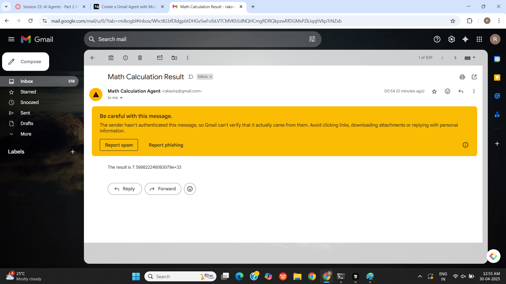
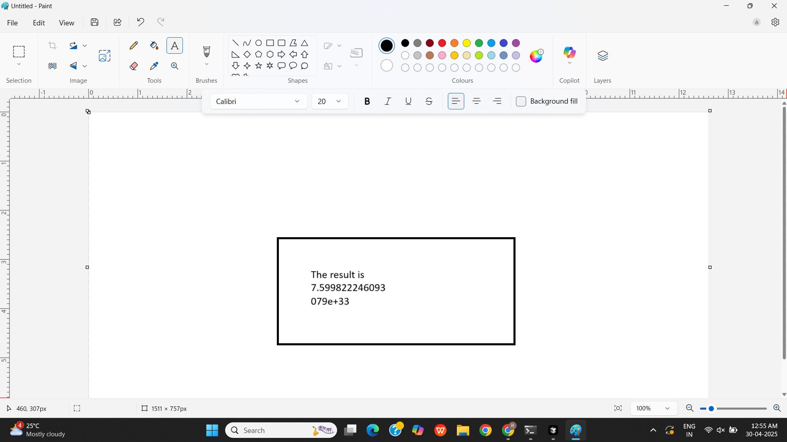

# Math Calculation Agent

## Overview
The Math Calculation Agent is a Python application that performs a series of mathematical operations based on a given input string. It converts the string into ASCII values, calculates the sum of their exponentials, opens Microsoft Paint to visually represent the result, and sends an email with the final calculation.

## Features
- Converts a string to its ASCII values.
- Calculates the sum of the exponentials of the ASCII values.
- Opens Microsoft Paint to draw a rectangle and display the result.
- Sends an email with the calculation result.

## How It Works
1. **Input**: The program takes a string input (e.g., "INDIA").
2. **ASCII Conversion**: The string is converted into an array of ASCII values.
3. **Exponential Sum Calculation**: The program calculates the sum of the exponentials of the ASCII values.
4. **Visual Representation**: Microsoft Paint is opened, and a rectangle is drawn with the result displayed as text.
5. **Email Notification**: An email is sent to the specified address with the calculation result.

## Repository Structure

A25

 - example2.py # Main script for calculations and email sending
 - talk2mcp-2.py # Script for interacting with the MCP server
 - images # Folder containing images
     -Mail.png # Email notification image
     -Paint.png # Paint visualization image
 - logs.md # Contains the log details


## Images
The following images are included in the `images` folder:
-   
  Shows the email sent with the calculation result.
  
-   
  Displays the rectangle drawn in Microsoft Paint with the result.

## Installation
1. Clone the repository.
2. Install the required packages:
   ```bash
   pip install google-auth-oauthlib google-auth-httplib2 google-api-python-client
   ```
3. Place your `credentials.json` file in the project directory.
4. Run the application:
   ```bash
   python talk2mcp-2.py
   ```

